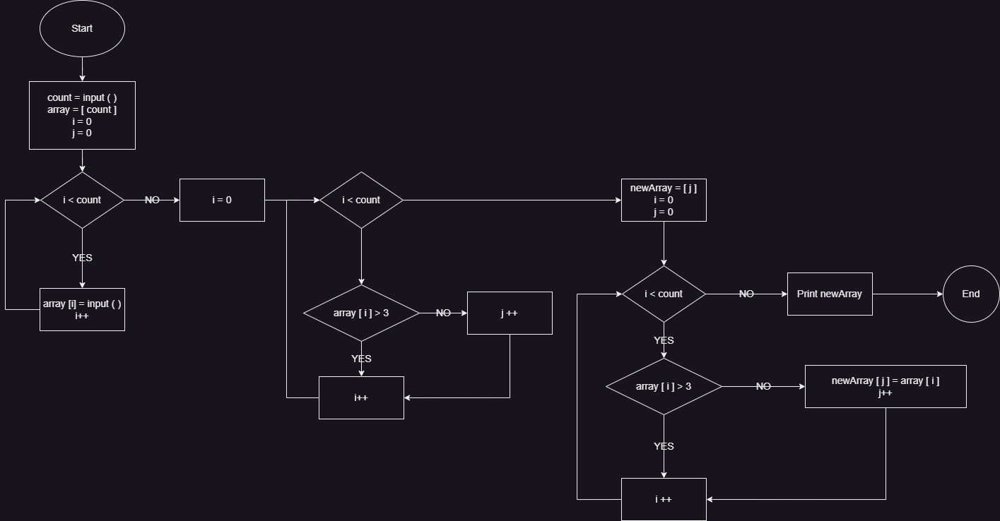

# **Задача**
Написать программу, которая из имеющегося массива строк формирует новый массив из строк, длина которых меньше, либо равна 3 символам. Первоначальный массив можно ввести с клавиатуры, либо задать на старте выполнения алгоритма. При решении не рекомендуется пользоваться коллекциями, лучше обойтись исключительно массивами.

---

## **Содержание**
1. [Общий вид решения](#общий-вид-решения)
2. [Описание решения](#описание-решения)

---
## **Общий вид решения**
Решение задачи будет выполняться согласно составленной блок-схеме.

---

## **Описание решения**
Решение реализовано следующим образом:
1. Пользователь вводит *число*, соответствующее *числу элементов* массива строк, которые он введет позже.
2. Написан метод *FillArray*, который на вход принимает *число*, введённое пользователем и возвращает *массив строк*. Метод создает массив строк с количеством элементов, равным принятому методом числу, и предлагает пользователю заполнолнить массив строк.
3. Написан метод *CountOfLessThree*, который на вход принимает массив строк и возвращает число, равное числу элементов массива, чья длина не превышает трёх символов.
4. Написан метод *ArrayOfLessThree*, принимающий на вход исходный массив строк, созданный методом *FillArray*, и число, возвращенное методом *CountOfLessThree*. Метод *ArrayOfLessThree* возвращает новый массив строк. Длина нового массива строк соответствует принятому методом числу. Далее метод перебирает исходный массив строк и в случае, если длина элемента массива не превышает трёх символов, записывает этот элемент в новый массив строк.
5. Написан метод PrintArray, принимающий на вход новый массив строк, возвращённый методом *ArrayOfLessThree*. Метод выводит в терминал элементы принятого массива.